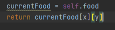

# IntroToAI_Pacman
Project in Introduction to AI A.Y. 2020-2021

<!-- Table of Contents -->

    
Table of Contents

    <ol>
        <li><a href="#about-the-project">About the Project</a></li>
        <li><a href="#built-with">Built With</a></li><li><a href="#introduction">Introduction</a></li>
        <li><a href="#files-to-edit">Files to Edit</a></li>
        <li><a href="#welcome-to-pacman">Welcome to Pacman</a></li>
        <li>
            <a href="#project-1-search-in-pacman">Project 1: Search in Pacman*</a>
            <ol>
                <li><a href="#question-1-finding-a-fixed-food-dot-using-depth-first-search">Question 1</a></li>
                <li><a href="#question-2-breadth-first-search">Question 2</a></li>
                <li><a href="#question-3-varying-the-cost-function">Question 3</a></li>
                <li><a href="#question-4-a-search">Question 4</a></li>
                <li><a href="#question-5-finding-all-the-corners">Question 5</a></li>
                <li><a href="#question-6-corners-problem-heuristic">Question 6</a></li>
                <li><a href="#question-7-eating-all-the-dots">Question 7</a></li>
                <li><a href="#question-8-suboptimal-search">Question 8</a></li>
            </ol>
        </li>
    </ol>

# About the Project
Contains the code that we submitted to our professor in Intro to AI as a requirement for the said course. Alongside the problem is an explanation that I have formulated on my own based on my understanding of the processes. This project implements different search algorithms including **bfs**, **dfs**, **uniform-cost search**, and **a\* search**.

This project was taken directly from  UC Berkeley's Introduction to AI course that was adapted by our professor in our Introduction to AI course. Some aspects of this project are taken directly from their course such as the introduction, how to use this program, and more. They are indicated by an **asterisk** (*). The only contribution I have is the search algorithm and the explanation on each problem in ***italicized*** format.

# Built With
- 

# Introduction*
In this project, your Pacman agent will find paths through his maze world, both to reach a particular location and to collect food efficiently. You will build general search algorithms and apply them to Pacman scenarios.

The code for this project consists of several Python files, some of which you will need to read and understand in order to complete the assignment, and some of which you can ignore. You can download all the code and supporting files as a zip archive (see search.zip).

## Files to Edit:
- search.py
- searchAgents.py

# Welcome to Pacman*
After downloading the code (search.zip), unzipping it, and changing to the directory, you should be able to play a game of Pacman by typing the following at the command line:

`python pacman.py`

Pacman lives in a shiny blue world of twisting corridors and tasty round treats. Navigating this world efficiently will be Pacman's first step in mastering his domain.

The simplest agent in `searchAgents.py` is called the **GoWestAgent**, which always goes West (a trivial reflex agent). This agent can occasionally win:

`python pacman.py --layout testMaze --pacman GoWestAgent`

But, things get ugly for this agent when turning is required:

`python pacman.py --layout tinyMaze --pacman GoWestAgent`

If Pacman gets stuck, you can exit the game by typing `CTRL-c` into your terminal.

Soon, your agent will solve not only tinyMaze, but any maze you want.

Note that pacman.py supports a number of options that can each be expressed in a long way (e.g., `--layout`) or a short way (e.g., `-l`). You can see the list of all options and their default values via:

`python pacman.py –h`

Also, all of the commands that appear in this project also appear in commands.txt, for easy copying and pasting. In UNIX/Mac OS X, you can even run all these commands in order with bash commands.txt.

# Project 1: Search in Pacman*

## Question 1: Finding a Fixed Food Dot using Depth First Search*

In `searchAgents.py`, you'll find a fully implemented SearchAgent, which plans out a path through Pacman's world and then executes that path step-by-step. The search algorithms for formulating a plan are not implemented -- that's your job. 

First, test that the `SearchAgent` is working correctly by running:

`python pacman.py -l tinyMaze -p SearchAgent -a fn=tinyMazeSearch`

The command above tells the `SearchAgent` to use `tinyMazeSearch` as its search algorithm, which is implemented in search.py. Pacman should navigate the maze successfully.

Now it's time to write full-fledged generic search functions to help Pacman plan routes! Pseudocode for the search algorithms you'll write can be found in the lecture slides. Remember that a search node must contain not only a state but also the information necessary to reconstruct the path (plan) which gets to that state.

**Important note**: Make sure to use the `Stack`, `Queue` and `PriorityQueue` data structures provided to you in `util.py`! These data structure implementations have particular properties which are required for compatibility with the autograder.

**Hint**: Each algorithm is very similar. Algorithms for DFS, BFS, UCS, and `A*` differ only in the details of how the fringe is managed. So, concentrate on getting DFS right and the rest should be relatively straightforward. Indeed, one possible implementation requires only a single generic search method which is configured with an algorithm-specific queuing strategy. (Your implementation need not be of this form to receive full credit).

Implement the depth-first search (DFS) algorithm in the depthFirstSearch function in search.py. To make your algorithm complete, write the graph search version of DFS, which avoids expanding any already visited states.

Your code should quickly find a solution for:

`python pacman.py -l tinyMaze -p SearchAgent`

`python pacman.py -l mediumMaze -p SearchAgent`

`python pacman.py -l bigMaze -z .5 -p SearchAgent`

**Is the exploration order what you would have expected?**
*The exploration order is exactly what we have expected. We expected that there will be unexplored areas (not marked with red) near Pacman’s location because those locations are on one side of the graph as DFS expands on only one side (always left or always right) as long as there are child nodes or if the goal is found.*

**Does Pacman actually go to all the explored squares on his way to the goal?**
*No, Pacman only goes on one path which is the array of returned directions in reverse order from the goal.*

**Is this a least cost solution? If not, think about what depth-first search is doing wrong.**
*No, the solution is not the least cost. It can be seen when using the medium and tiny mazes. DFS tend to expand fully on one side of the tree or graph thus if the goal is not on that side, the search agent will spend so much time or travel long distance on that side then finally which to another side.*

**How did your implementation of DFS solved Pacman’s problem?**
*Our implementation can be summarized into the following steps: first, expand the nodes on one side, continue expanding until goal is found or that there are no more nodes to expand; next, make a list that keeps track of explored nodes, which is important so that the expansion of nodes will not go infinitely; then, at every node check if goal state, else get the unexplored child nodes and their ‘parent’ node (which is the current node) and add them in the stack; lastly, if the node contains the goal state, enter another loop where we add the ‘action’ needed to get to that node to the solution. As long as there is a ‘parent’ in that node, keep adding the action to the solution. We can imagine this in a tree such that once a goal is found, trace it back to its root, the order in reverse is the solution to the problem. Below is our implementation of DFS in the code. This do not use the iterative deepening algorithm but only the generic DFS.*

*First of all, we needed to find Pacman’s initial location in the maze. This was done by creating a node and store the state to that node. Using the commands stated on the commented block, we were able to get the starting state, the goal state, and the successor states of the current node.*

*Push the initial node to a stack and enter a loop that is: continue looping if the stack is not empty or until goal is found. At each loop, we have to pop a node from the stack and check the node if it is a goal state. If the current node is the goal, we will return the solution which will discussed later. Else, expand to get all the successors of the current node and push them into the stack if they are unexplored. Note that ‘parent’ is added to the dictionary since it will be useful in tracing nodes back to its root once goal is found.*

*If the current node is the goal state, we have to trace the node back to its root (which is the initial state). As long as there exists a ‘parent node’, add the ‘action’ of that node to the solution and change the current node into that ‘parent node’. Soon the program will reach the root node and since the root node has no parent node, the while loop will be broken. The solution will be returned in reverse order.*

*If the program exits the loop by emptied queue, this means that there is no solution found.*

(<a href="#readme-top">back to top</a>)

## Question 2: Breadth First Search*

Implement the breadth-first search (BFS) algorithm in the breadthFirstSearch function in search.py. Again, write a graph search algorithm that avoids expanding any already visited states. Test your code the same way you did for depth-first search.

`python pacman.py -l mediumMaze -p SearchAgent -a fn=bfs`

`python pacman.py -l bigMaze -p SearchAgent -a fn=bfs -z .5`

**Does BFS find a least cost solution? If not, check your implementation.**
*Using the medium and tiny mazes, the path cost of BF Search is much lower (168 and 8) compared to DF Search (210 and 10). On the big Maze, both algorithm cost 210 to get to the goal state but BFS tend to expand more than DFS. In theory BFS does not find the least cost solution but rather the shortest path but since all actions cost 1 unit, the BFS solution finds the least cost.*

Hint: If Pacman moves too slowly for you, try the option `--frameTime 0`.

Note: If you've written your search code generically, your code should work equally well for the eight-puzzle search problem without any changes.

`python eightpuzzle.py`

**How did your implementation of BFS solved Pacman’s problem?**
*The implementation looks exactly like the DFS but with slightly different order and instead of stack, the BFS uses queue. The idea is to keep expanding the nodes until the goal is found and instead of checking the last node to enter the stack, we check the one next in line. By definition, BFS expands level by level when using queues.*

*Initially the starting node is pushed into the queue to enter the loop. At each loop, a node is popped and ignored if it already is inside the explored list, otherwise, goal test is performed. If the goal is found, the algorithm returns the solution as a list of ‘actions’ that are traced from the current node to the root node in reverse order. If the goal is not found, expand the node by getting its successors. The successors are added to the queue if they are not yet explored. If the program exits the loop by means of emptied queue, this means that there is no solution found.*

(<a href="#readme-top">back to top</a>)

## Question 3: Varying the Cost Function*

While BFS will find a fewest-actions path to the goal, we might want to find paths that are "best" in other senses. Consider mediumDottedMaze and mediumScaryMaze.

By changing the cost function, we can encourage Pacman to find different paths. For example, we can charge more for dangerous steps in ghost-ridden areas or less for steps in food-rich areas, and a rational Pacman agent should adjust its behavior in response.

Implement the uniform-cost graph search algorithm in the uniformCostSearch function in `search.py`. We encourage you to look through `util.py` for some data structures that may be useful in your implementation. You should now observe successful behavior in all three of the following layouts, where the agents below are all UCS agents that differ only in the cost function they use (the agents and cost functions are written for you):

`python pacman.py -l mediumMaze -p SearchAgent -a fn=ucs`

`python pacman.py -l mediumDottedMaze -p StayEastSearchAgent`

`python pacman.py -l mediumScaryMaze -p StayWestSearchAgent`

Note: You should get very low and very high path costs for the StayEastSearchAgent and StayWestSearchAgent respectively, due to their exponential cost functions (see searchAgents.py for details).

**How did your implementation of UCS solved Pacman’s problem?**
*All the uninformed search algorithms, BFS, DFS, and UCS, have almost the same logical implementations but uses different data structures. UCS uses priority queue and an almost variation of both Breadth First Search algorithm. Nodes with the lowest cost is always in front of the queue (prioritized) and are popped from the queue. The program uses min heaps to achieve that exact action by deleting the root of the min heap.*

*The implementation follows the same with BFS and DFS, only that priority queue requires path-cost which are mostly ignored in BFS and DFS.*

*Every node popped from the queue is the lowest cost. The program checks if that node exists in the explored list. If not explored, the program performs goal test. If it is the goal state, it returns the solution that is exactly the same with the other uninformed search algorithms. Else, we add the node to the explored list, and expand to acquire its successors. In expanding the successors, its path-cost is updated so that it is the sum of its original path-cost and the path-cost of its parent.*

*If the successor is not yet explored, there are three ways that the child node may appear and three ways that the implementation deals with it. It checks if the child node is already in the queue, then if it is, it checks if the child node [1] have a path-cost higher that its older cost or [2] have a path-cost lower. If it has higher cost, update it and reconstruct the heaps. If lower, do nothing. And finally, [3] if is not in the queue, then add it to the queue. This was provided by the program and not by us.*

*If it exits the loop without returning a solution, an error is raised by the program to the user.*

(<a href="#readme-top">back to top</a>)

## Question 4: A* search*

Implement `A*` graph search in the empty function aStarSearch in search.py. `A*` takes a heuristic function as an argument. Heuristics take two arguments: a state in the search problem (the main argument), and the problem itself (for reference information). The nullHeuristic heuristic function in search.py is a trivial example.

You can test your `A*` implementation on the original problem of finding a path through a maze to a fixed position using the Manhattan distance heuristic (implemented already as manhattanHeuristic in `searchAgents.py`).

`python pacman.py -l bigMaze -z .5 -p SearchAgent -a fn=astar,heuristic=manhattanHeuristic`

You should see that `A*` finds the optimal solution slightly faster than uniform cost search (about 549 vs. 620 search nodes expanded in our implementation, but ties in priority may make your numbers differ slightly). 

**What happens on openMaze for the various search strategies?**
*Using DFS, Pacman seems to move on horizontally from left to right and vice versa, downwards towards the goal. It is not very optimal such that it wastes time by not going directly towards its goal. Rather, moves as if there are walls on top and bottom  that it needs to move in a horizontal straight line until it reaches a vertical wall. DFS has the most cost among all the various search strategies having 298. Using BFS seems to solve this case wherein Pacman moves directly towards its goal and has a much lower cost of 54. But the problem is that it expands way too big (576) and may be a bit slow compared to DFS. UCS does the same thing with BFS since it is a variant of BFS used in problems that has no constant path-cost. `A*`, on the other hand, also has a total cost of 54 but it expands smaller compared to BFS and UCS. The total nodes expanded for `A*` is 535.*

**How did your implementation of a* solved Pacman’s problem?**
*The implementation of `A*` is exactly like the implementation of UCS in the book. The only difference is that the priority depends on the heuristic cost f(n) which is the sum of the backward cost g(n) and forward cost h(n). *

*The node with the least heuristic cost f(n) always gets chosen first from the queue by using min heaps priority queue. Then goal test is applied. When goal is found the solution is returned by tracing the current node to its root node using the ‘parent’ attribute of the node. Else, when goal is not found, the program expands by getting all the unexplored successors and updating its heuristic cost. When the program exits the loop without returning a solution, the program raises an error that states ‘No solution’.*

(<a href="#readme-top">back to top</a>)

## Question 5: Finding All the Corners*

The real power of `A*` will only be apparent with a more challenging search problem. Now, it's time to formulate a new problem and design a heuristic for it.

In corner mazes, there are four dots, one in each corner. Our new search problem is to find the shortest path through the maze that touches all four corners (whether the maze actually has food there or not). Note that for some mazes like `tinyCorners`, the shortest path does not always go to the closest food first! Hint: the shortest path through `tinyCorners` takes 28 steps.

Note: Make sure to complete Question 2 before working on Question 5, because Question 5 builds upon your answer for Question 2.

Implement the CornersProblem search problem in `searchAgents.py`. You will need to choose a state representation that encodes all the information necessary to detect whether all four corners have been reached. Now, your search agent should solve:

`python pacman.py -l tinyCorners -p SearchAgent -a fn=bfs,prob=CornersProblem`

`python pacman.py -l mediumCorners -p SearchAgent -a fn=bfs,prob=CornersProblem`

To receive full credit, you need to define an abstract state representation that does not encode irrelevant information (like the position of ghosts, where extra food is, etc.). In particular, do not use a Pacman GameState as a search state. Your code will be very, very slow if you do (and also wrong).

Hint: The only parts of the game state you need to reference in your implementation are the starting Pacman position and the location of the four corners.

Our implementation of `breadthFirstSearch` expands just under 2000 search nodes on mediumCorners. However, heuristics (used with `A*` search) can reduce the amount of searching required.

**How did your implementation of the Corners Problem solve Pacman’s problem?**
*The task in question 5 is to implement a new search problem. Instead of having goals reached one by one, the goal in Corners Problem is to touch all four corners of the maze that may or may not contain any food. This should be achieve with the shortest path among through the maze. To implement this problem is to first get the location of all corners of the Maze. The next is to keep track of these corners so that once a corner has been explored, Pacman will not touch it again. This was done by the program already.*

***corners*** *is an list that contains all the corners of the Maze.*

***Initial_explored_corners*** *keeps track of the corners Pacman has visited. The three main things to provide in the program is the functions `getStartState()`, `isGoalState()`, and `getSuccessors()`. In this new search problem, a node has to track of the corners, thus `getStartState()` returns two values: Pacman’s initial coordinate and an empty list that will record corners. Hence the code:*

*The condition of achieving the goal state is different now compared to the previous search problem. The condition now is when all the corners are recorded in the list, the goal is achieved. `state` obj which contains both the coordinate, and the list is passed into `isGoalState()` function. There, the object is added to the list if its coordinate is a corner. The function will return false when the object’s coordinate is not a corner or when all corners are not yet explored. Otherwise, it will return true.*

*To implement `getSuccessors()` function, the program will enter a loop to check all the nodes on the north, south, east, and west of the current node. A snippet of code was already provided by the program for us to work with. That block of codes determine whether the next node is a wall or not, and the coordinate of the next node. If that node is a wall, then iterate, otherwise, check if the next node is a corner and add it to a temporary list if so. Add that successor to the list of successors. Keep repeating until all directions have been checked and return the successors as a list.*

(<a href="#readme-top">back to top</a>)

## Question 6: Corners Problem: Heuristic*

Note: Make sure to complete Question 4 before working on Question 6, because Question 6 builds upon your answer for Question 4.

Implement a non-trivial, consistent heuristic for the `CornersProblem` in `cornersHeuristic`.

`python pacman.py -l mediumCorners -p AStarCornersAgent -z 0.5`

Note: `AStarCornersAgent` is a shortcut for

`-p SearchAgent -a fn=aStarSearch,prob=CornersProblem,heuristic=cornersHeuristic.`

**Admissibility vs. Consistency:** Remember, heuristics are just functions that take search states and return numbers that estimate the cost to a nearest goal. More effective heuristics will return values closer to the actual goal costs. To be admissible, the heuristic values must be lower bounds on the actual shortest path cost to the nearest goal (and non-negative). To be consistent, it must additionally hold that if an action has cost c, then taking that action can only cause a drop in heuristic of at most c.

Remember that admissibility isn't enough to guarantee correctness in graph search -- you need the stronger condition of consistency. However, admissible heuristics are usually also consistent, especially if they are derived from problem relaxations. Therefore it is usually easiest to start out by brainstorming admissible heuristics. Once you have an admissible heuristic that works well, you can check whether it is indeed consistent, too. The only way to guarantee consistency is with a proof. However, inconsistency can often be detected by verifying that for each node you expand, its successor nodes are equal or higher in in f-value. Moreover, if UCS and `A*` ever return paths of different lengths, your heuristic is inconsistent. This stuff is tricky!

**Non-Trivial Heuristics**: The trivial heuristics are the ones that return zero everywhere (UCS) and the heuristic which computes the true completion cost. The former won't save you any time, while the latter will timeout the autograder. You want a heuristic which reduces total compute time, though for this assignment the autograder will only check node counts (aside from enforcing a reasonable time limit).

**Grading**: Your heuristic must be a non-trivial non-negative consistent heuristic to receive any points. Make sure that your heuristic returns 0 at every goal state and never returns a negative value. Depending on how few nodes your heuristic expands, you'll be graded:

| Number of nodes expanded | Grade |
| ------------------------ | :---: |
| more than 2000 | 0/3 |
| at most 2000 | 1/3 |
| at most 1600 | 2/3 |
| at most 1200 | 3/3 |

**Remember**: If your heuristic is inconsistent, you will receive no credit, so be careful!

**How did your implementation of the Corners Problem: Heuristic solve Pacman’s problem?**
*The implementation of the new heuristic requires the node to be admissible and consistent. Using Manhattan Distance ensures that the estimate cost of a node is lower than or equal to the actual cost of that node to the goal. The implementation in Q6 allows the use of a consistent heuristic in solving the corners problem by always returning the total Manhattan distance as the estimate from the current node to each of the goals which is added to the actual cost of each of the children node in `search.py`.*

In Q5, since the default heuristic is `null`, there is no heuristic added. In this snippet of code, heuristic is returned as the total-cost which was calculated by adding the smallest or minimum heuristic cost of a node from one corner to the next. The code below finds the Manhattan distance of the current node to the unexplored corners and assign the smallest cost to the heuristic cost using the function `min()`. That corner is removed from the list and the loop goes on until all corners are explored or when `unexplored_corners` is empty.

(<a href="#readme-top">back to top</a>)

# Question 7: Eating All The Dots*

Now we'll solve a hard search problem: eating all the Pacman food in as few steps as possible. For this, we'll need a new search problem definition which formalizes the food-clearing problem: `FoodSearchProblem` in searchAgents.py (implemented for you). A solution is defined to be a path that collects all of the food in the Pacman world. For the present project, solutions do not take into account any ghosts or power pellets; solutions only depend on the placement of walls, regular food and Pacman. (Of course ghosts can ruin the execution of a solution! We'll get to that in the next project.) If you have written your general search methods correctly, `A*` with a null heuristic (equivalent to uniform-cost search) should quickly find an optimal solution to `testSearch` with no code change on your part (total cost of 7).

`python pacman.py -l testSearch -p AStarFoodSearchAgent`

Note: `AStarFoodSearchAgent` is a shortcut for 
`-p SearchAgent –a fn=astar,prob=FoodSearchProblem,heuristic=foodHeuristic.`

You should find that UCS starts to slow down even for the seemingly simple `tinySearch`. As a reference, our implementation takes 2.5 seconds to find a path of length 27 after expanding 5057 search nodes.

Note: Make sure to complete Question 4 before working on Question 7, because Question 7 builds upon your answer for Question 4.

Fill in `foodHeuristic` in searchAgents.py with a consistent heuristic for the `FoodSearchProblem`. Try your agent on the `trickySearch` board:

`python pacman.py -l trickySearch -p AStarFoodSearchAgent`

Our UCS agent finds the optimal solution in about 13 seconds, exploring over 16,000 nodes.

Any non-trivial non-negative consistent heuristic will receive 1 point. Make sure that your heuristic returns 0 at every goal state and never returns a negative value. Depending on how few nodes your heuristic expands, you'll get additional points:

| Number of nodes expanded | Grade |
| ------------------------ | :---: |
| more than 15000          |  1/4  |
| at most 15000            |  2/4  |
| at most 12000            |  3/4  |
| at most 9000             |  4/4 (full credit; medium) |
| at most 7000             |  5/4 (optional extra credit; hard) |

**Remember**: If your heuristic is inconsistent, you will receive no credit, so be careful! Can you solve mediumSearch in a short time? If so, we're either very, very impressed, or your heuristic is inconsistent.

**How did your implementation of the Corners Problem: Heuristic solve Pacman’s problem?**
*Q7 follows a different heuristic such that the goal now is to clear food off the maze. The new heuristic returns 0 when it the state is in goal state.*

*else, it returns the food position with the highest estimation out of all the food positions using the `max()` function. This heuristic limits the search up to any number, say 5, food positions at a time to avoid expanding too much by using a flag variable. This implementation makes use of the `mazeDistance()` function which returns the distance of one point to another using breadth first search in search.py to get the heuristic cost of each food position.*

*The `mazeDistance()` function is used so that every node is admissible and consistent because Manhattan distance is not reliable here since it tends to choose nodes with shortest Manhattan distance but longer actual cost.*

(<a href="#readme-top">back to top</a>)

# Question 8: Suboptimal Search*

Sometimes, even with `A*` and a good heuristic, finding the optimal path through all the dots is hard. In these cases, we'd still like to find a reasonably good path, quickly. In this section, you'll write an agent that always greedily eats the closest dot. `ClosestDotSearchAgent` is implemented for you in searchAgents.py, but it's missing a key function that finds a path to the closest dot.

Implement the function `findPathToClosestDot` in searchAgents.py. Our agent solves this maze (suboptimally!) in under a second with a path cost of 350:

`python pacman.py -l bigSearch -p ClosestDotSearchAgent -z .5 `

Hint: The quickest way to complete `findPathToClosestDot` is to fill in the `AnyFoodSearchProblem`, which is missing its goal test. Then, solve that problem with an appropriate search function. The solution should be very short!

Your `ClosestDotSearchAgent` won't always find the shortest possible path through the maze. Make sure you understand why and try to come up with a small example where repeatedly going to the closest dot does not result in finding the shortest path for eating all the dots.

**How did your implementation of the Corners Problem: Heuristic solve Pacman’s problem?**
*Q8 requires us to write an agent that greedily eats the closest dot. Everything is implemented except that it does not know how to get to the closest dot. This means that we had to provide a searching algorithm to Pacman where the goal is to find a node with a food in it. We used BFS from search.py to return the solution in a form of a list.*

*The goal test is different so that it returns true if that state has food, otherwise, false. This code was found inside pacman.py, the function `getFood()` returns a grid of Boolean food indicator, basically the whole map but with coordinates and Boolean indicators.*

*The code below is a simplification of the commented code above when there is a need to access the Food grid. We assigned `currentFood` with `self.food` which is initialized from the food grid from function `getFood()`. At every goal test from the BFS algorithm, it checks if there is food at (x, y). If true, the BFS return a path, if false, the bfs expands. BFS is used in here since it expands in all directions of Pacman and the goal is to find the dot closest to Pacman.*

*The reason why this agent doesn’t always find the shortest possible path is because it is greedy. Greedy algorithms are goal-oriented and does not consider the cost of the path. The instant that this agent finds food, it will go straight to that location not taking consideration that it will get Pacman further from another dot. This case exists in a breadth first search algorithm where Pacman is busy eating a line of dots and misses a dot in one section and proceeds to go to one section and effectively increases the distance of Pacman section as he eats dots.*

(<a href="#readme-top">back to top</a>)
